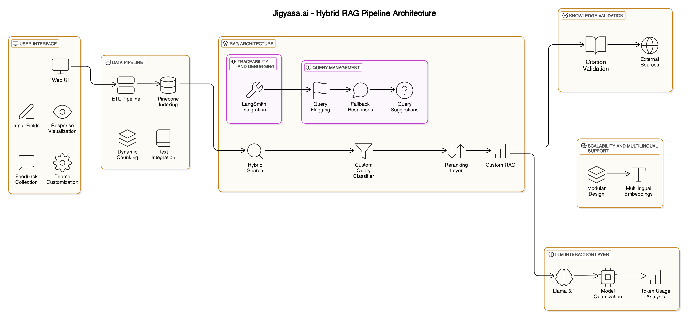

# **Jigyasa**  
*Bridging Ancient Wisdom and Modern Accessibility*

---

## **Problem**  
Understanding spiritual texts like the *Bhagavad Gita* and *Patanjali Yoga Sutras* is challenging due to:  
- Complex language.  
- Contextual ambiguity.  
- Information overload.  

---

## **Solution**  
**Jigyasa** simplifies access to spiritual wisdom using a **Retrieval-Augmented Generation (RAG)** pipeline.  
It retrieves relevant shlokas and generates contextually accurate responses through advanced AI techniques and an intuitive interface.  

---

## **Key Features**  
### 🔍 **Web UI**  
- Built for seamless and intuitive user interaction.  

### 🛠 **RAG Pipeline**  
- Combines **semantic retrieval** with **structured knowledge retrieval**.  

### 📈 **LangSmith Integration**  
- Ensures traceability, transparency, and debugging support.  

### ✅ **Hallucination Mitigation**  
- Responses are backed by citations and confidence scoring for reliability.  

### 💡 **Cost Optimization**  
- Model quantization reduces costs and improves inference speed.  

### 🌍 **Scalability**  
- Designed to integrate new texts and support multilingual capabilities.  

---

## **Technical Highlights**  
### 🚀 **Retrieval**  
- Uses **Pinecone Vector DB** for efficient semantic search.  
- Reranks results using **BERT-based models** for relevance.  

### 🤖 **Response Generation**  
- Powered by **LLaMA 3.1**, with prompt engineering for accurate, citation-backed answers.  

### 🔍 **Traceability**  
- Integrated with **LangSmith** for tracking and debugging the RAG pipeline.  

---

## **System Architecture**  
  
*An overview of the architecture, from query processing to response generation.*  

---

## **Results/Metrics**  
### 📊 **Performance Overview**  
- **Retrieval Accuracy**: 71% F1-score on test queries.  
- **Cost Reduction**: 35% savings through model quantization.  
- **Latency**: 2x faster inference with an average of 150ms/query.  

---

## **Future Scope**  
### 🌟 **Planned Enhancements**  
1. **Agentic AI**: Enable dynamic workflows for better decision-making.  
2. **Multilingual Support**: Expand accessibility to different languages.  
3. **Cross-referencing**: Enhance reranking and interlinking mechanisms.  

## **Technology Stack**  
- **Front-end**: Web UI 
- **Back-end**: LLaMA 3.1, Pinecone  
- **Development Tools**: LangSmith, Python  

---

## **Contributing**  
Contributions are welcome! Please fork the repository, create a new branch, and submit a pull request.  

---

## **License**  
This project is licensed under the MIT License. See the LICENSE file for details.  

---

*Jigyasa bridges ancient wisdom and modern accessibility with innovative technology, ensuring a seamless exploration of spiritual texts.*  
